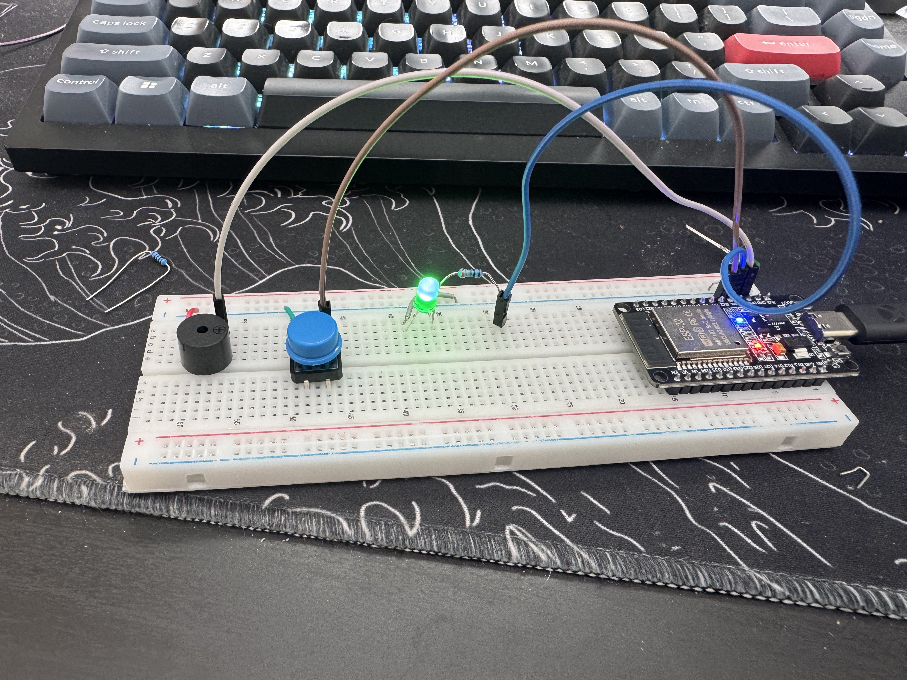

# ESP32 FreeRTOS Multi-Task Controller

A simple embedded systems project demonstrating **real-time multitasking using an ESP32 and FreeRTOS**. This system runs multiple concurrent tasks for input handling, actuator control, and system telemetry using RTOS scheduling and inter-task communication.

This project demonstrates key **real-time operating system concepts** including task scheduling, queues, and concurrent execution on an ESP32 microcontroller running FreeRTOS.

---

# Demo

---

# Project Overview

This project implements a **multi-task embedded system** on an ESP32 where several independent tasks run concurrently.

| Task | Function |
|-----|-----|
| LED Task | Blinks LED to indicate system heartbeat |
| Button Task | Detects user input |
| Buzzer Task | Activates buzzer when button pressed |
| Telemetry Task | Sends system messages over Serial |

A **FreeRTOS queue** is used for communication between tasks.

Button events are sent through the queue and received by other tasks that respond accordingly.

---

# Hardware Requirements

- ESP32 development board
- LED
- 220Ω resistor
- Push button
- Active buzzer (optional)
- Breadboard
- Jumper wires

---

# Wiring

### LED
ESP32 GPIO 2 → Resistor → LED → GND

### Button
ESP32 GPIO 4 → Button → GND
Internal pull-up resistor is used.

### Buzzer
ESP32 GPIO 15 → Buzzer → GND

# Running the Project

1. Connect the hardware according to the wiring diagram.
2. Open the project in Arduino IDE.
3. Select your ESP32 board.
4. Upload the code.
5. Open the Serial Monitor at **115200 baud**.

Pressing the button should trigger the buzzer and print a message in the Serial Monitor.

---
